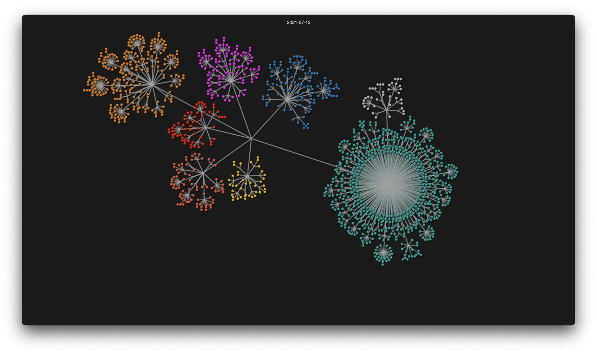
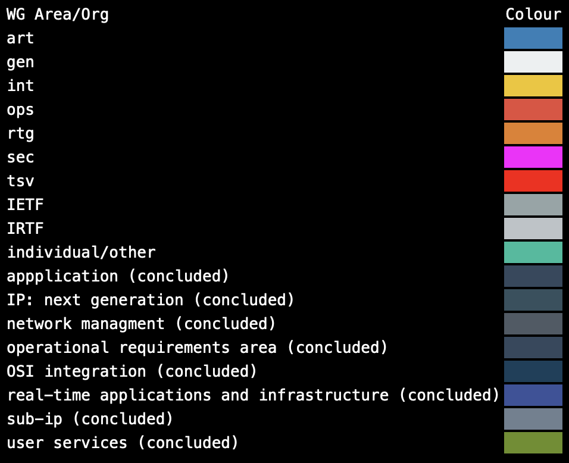

# visualize-ietf
Visualization of IETF (Internet Engineering Task Force) IDs (Internet Draft) and RFC (Request for Comments)

[](https://www.youtube.com/playlist?list=PLuakzjxkt1oAjiOhkq66IWgspqnp_ZdfN)

## Visualizations

* [ID Authoring for 2021 (From January 2021 to July 2021)](https://www.youtube.com/watch?v=3pmf486WPaQ)
* [GEN (General Area) Working Groups](https://www.youtube.com/watch?v=a9PpqZamkck)
* [RTG (Routing Area) Working Groups](https://www.youtube.com/watch?v=KdR-yusyPw8)
* [ART (Applications and Real-Time Area) Working Groups](https://www.youtube.com/watch?v=45PexHj_VjM)
* [TSV (Transport Area) Working Groups](https://www.youtube.com/watch?v=U0qOyCP7WTc)
* [OPS (Operations and Management Area)](https://www.youtube.com/watch?v=MKXWCtxr49A)
* [INT (Internet Area) Working Groups](https://www.youtube.com/watch?v=ieJGnrSpF8E)
* [SEC (Security Area) Working Groups](https://www.youtube.com/watch?v=SaUIjPF1oRA)

## Setup

* Clone project

```
git clone https://github.com/kesara/visualize-ietf.git
```

* Create and activate Python venv. (Tested with Pythn 3.9)

```
cd visualize-ietf
python -m venv venv
. venv/bin/activate
```

* Install Python dependencies

```
pip install -r requirements.txt
```

* Install [gource](https://gource.io/).

* Get Bibxml3 references.

```
rsync -avz rsync.ietf.org::bibxml-ids bibxml3
```

## Generating visualizations

* Created a sorted ID log

```
python id_log.py > id.log && sort -n id.log > id.log.sorted
```

* Create the visualization

```
gource --log-format custom --date-format '%Y-%m-%d' -a 0.5 --hide filenames -s 3 --bloom-intensity 0.01 --dir-name-depth 3 id.log.sorted
```

* Export original visualization as video and accelerate to under 8 minutes

```bash
# Step 1: Generate original quality video
gource --log-format custom --date-format '%Y-%m-%d' -a 0.5 --hide filenames -s 3 --bloom-intensity 0.01 --dir-name-depth 3 --output-ppm-stream - id.log.sorted | \
ffmpeg -y -r 60 -f image2pipe -vcodec ppm -i - \
-vcodec libx264 -preset medium -pix_fmt yuv420p \
-crf 18 -bf 0 ietf_original_full.mp4

# Step 2: Accelerate the video to fit within 8 minutes
ffmpeg -i ietf_original_full.mp4 -filter:v "setpts=PTS/3.0" -an ietf_visualization_8min.mp4
```

## Legend

